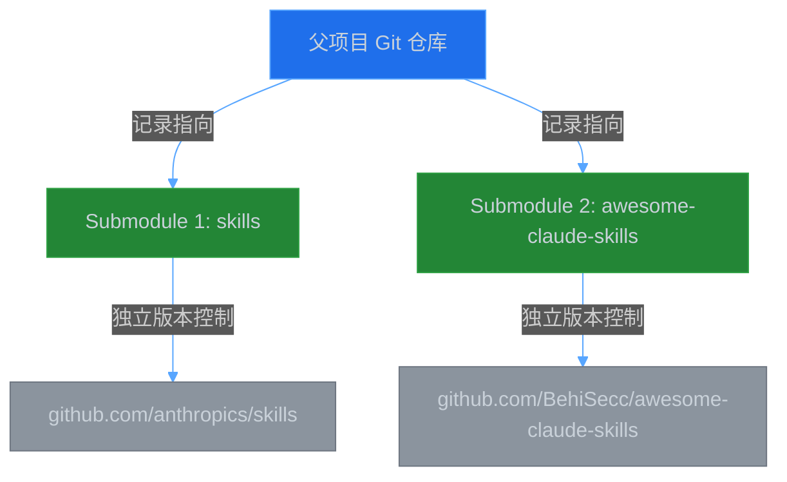
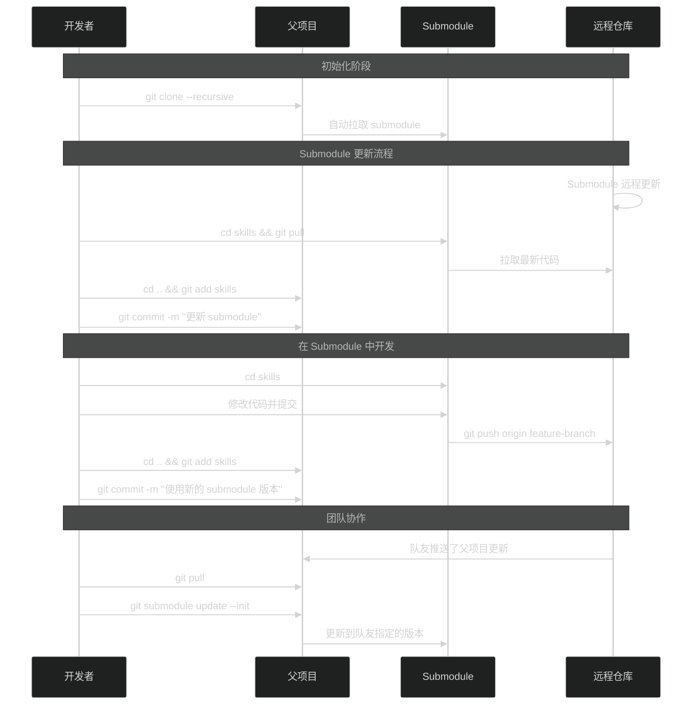
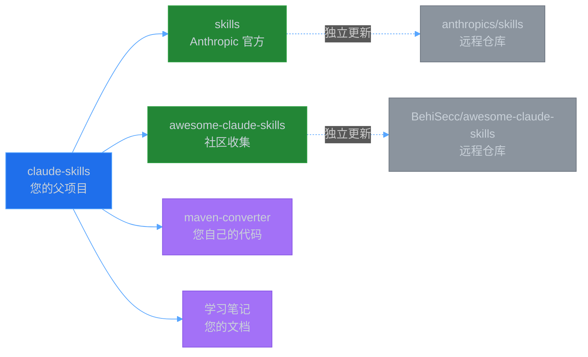

# Git Submodule 学习笔记

## 目录
- [什么是 Git Submodule？](#什么是-git-submodule)
- [为什么需要 Submodule？](#为什么需要-submodule)
- [Submodule 的工作原理](#submodule-的工作原理)
- [基本配置（已完成）](#基本配置已完成)
- [常用操作指南](#常用操作指南)
  - [克隆带有 Submodule 的项目](#克隆带有-submodule-的项目)
  - [更新 Submodule](#更新-submodule)
  - [在 Submodule 中工作](#在-submodule-中工作)
  - [提交父项目的更改](#提交父项目的更改)
- [工作流程图](#工作流程图)
- [常见问题与解决方案](#常见问题与解决方案)
- [最佳实践](#最佳实践)

---

## 什么是 Git Submodule？

**Git Submodule（子模块）** 是 Git 提供的一种机制，允许你在一个 Git 仓库中嵌入另一个 Git 仓库。每个 Submodule 都是一个独立的 Git 仓库，有自己的版本控制历史。

### 类比理解
想象一下：
- **父项目** 就像一个"管理目录"，记录了有哪些子项目以及它们的版本
- **子模块** 就像独立的项目，有自己的开发历史和更新节奏
- 父项目只记录"某个时间点，我使用的是子项目的哪个版本（commit）"

---

## 为什么需要 Submodule？

### 适用场景

1. **代码复用**：多个项目共享同一个库或组件
2. **第三方依赖**：引入外部项目作为依赖，但希望能独立更新
3. **项目组合**：将多个独立项目组合成一个大项目
4. **学习和研究**：像您当前的情况，收集多个学习资源到一个项目中

### 您的场景
```
claude-skills/                 (父项目 - 您的学习项目)
├── skills/                    (子模块 - Anthropic 官方技能库)
├── awesome-claude-skills/     (子模块 - 社区技能收集)
└── 您自己的文件和笔记
```

---

## Submodule 的工作原理



### 关键文件

#### 1. `.gitmodules` 文件
这是父项目中的配置文件，记录所有 submodule 的信息：

```ini
[submodule "skills"]
	path = skills
	url = git@github.com:anthropics/skills.git
[submodule "awesome-claude-skills"]
	path = awesome-claude-skills
	url = git@github.com:BehiSecc/awesome-claude-skills.git
```

#### 2. 父项目的 Git 索引
父项目不会存储子模块的文件内容，只存储：
- 子模块的路径
- 子模块当前使用的 commit SHA（版本指针）

---

## 基本配置（已完成）

### ✅ 您已经完成的配置

```bash
# 1. 从暂存区移除错误添加的目录
git rm --cached -f skills awesome-claude-skills

# 2. 添加 skills 为 submodule
git submodule add git@github.com:anthropics/skills.git skills

# 3. 添加 awesome-claude-skills 为 submodule
git submodule add git@github.com:BehiSecc/awesome-claude-skills.git awesome-claude-skills
```

### 当前状态
```
Changes to be committed:
  new file:   .gitmodules          (submodule 配置文件)
  new file:   awesome-claude-skills (指向 submodule 的指针)
  new file:   skills               (指向 submodule 的指针)
```

---

## 常用操作指南

### 克隆带有 Submodule 的项目

当其他人（或您在新机器上）克隆您的父项目时：

```bash
# 方法1：克隆时同时初始化 submodule
git clone --recursive <父项目URL>

# 方法2：先克隆，再初始化 submodule
git clone <父项目URL>
cd <项目目录>
git submodule init              # 初始化 submodule 配置
git submodule update            # 下载 submodule 内容

# 方法3：一步到位（推荐）
git clone <父项目URL>
cd <项目目录>
git submodule update --init --recursive
```

### 更新 Submodule

#### 场景1：更新某个 Submodule 到最新版本

```bash
# 进入 submodule 目录
cd skills

# 拉取最新代码
git pull origin master

# 返回父项目
cd ..

# 提交 submodule 的版本更新
git add skills
git commit -m "更新 skills submodule 到最新版本"
```

#### 场景2：批量更新所有 Submodule

```bash
# 更新所有 submodule 到远程仓库的最新版本
git submodule update --remote

# 如果有嵌套的 submodule（submodule 里还有 submodule）
git submodule update --remote --recursive
```

#### 场景3：同步父项目记录的 Submodule 版本

当团队成员更新了 submodule 版本，您拉取父项目后：

```bash
# 更新 submodule 到父项目记录的版本
git submodule update --init --recursive
```

### 在 Submodule 中工作

Submodule 本身就是一个完整的 Git 仓库，可以正常开发：

```bash
# 进入 submodule
cd skills

# 查看状态
git status

# 切换分支
git checkout -b my-feature

# 进行修改
echo "# My Note" >> notes.md

# 提交更改
git add notes.md
git commit -m "添加笔记"

# 推送到远程（如果您有权限）
git push origin my-feature

# 返回父项目
cd ..

# 父项目会检测到 submodule 的 commit 变化
git status
# 显示: modified:   skills (new commits)

# 如果要让父项目使用新的 commit
git add skills
git commit -m "更新 skills 到我的新提交"
```

### 提交父项目的更改

```bash
# 添加您自己的文件
git add maven-converter.skill
git add maven-converter/

# 提交
git commit -m "添加 Maven 转换器"

# 推送（如果有远程仓库）
git push origin master
```

---

## 工作流程图

### 完整的开发和更新流程



---

## 常见问题与解决方案

### 问题1：Submodule 目录是空的

**症状**：克隆项目后，submodule 目录存在但是空的

**原因**：克隆时没有初始化 submodule

**解决**：
```bash
git submodule update --init --recursive
```

### 问题2：Submodule 处于"detached HEAD"状态

**症状**：进入 submodule 后，显示不在任何分支上

**原因**：父项目指向的是具体的 commit，不是分支

**解决**：如果要开发，切换到分支
```bash
cd skills
git checkout master  # 或其他分支
```

### 问题3：忘记提交 Submodule 的更改

**症状**：在 submodule 中做了修改，但父项目没有记录

**解决**：
```bash
# 先在 submodule 中提交
cd skills
git add .
git commit -m "我的修改"

# 再在父项目中记录新的 commit
cd ..
git add skills
git commit -m "更新 skills 到包含我修改的版本"
```

### 问题4：如何删除 Submodule

```bash
# 1. 从 Git 中移除
git submodule deinit -f awesome-claude-skills
git rm -f awesome-claude-skills

# 2. 清理 Git 目录
rm -rf .git/modules/awesome-claude-skills

# 3. 提交删除
git commit -m "移除 awesome-claude-skills submodule"
```

### 问题5：Submodule 更新冲突

**症状**：`git submodule update` 时出现冲突

**解决**：
```bash
cd <submodule-directory>
git fetch
git merge origin/master  # 或处理冲突
cd ..
git add <submodule-directory>
git commit -m "解决 submodule 冲突"
```

---

## 最佳实践

### ✅ 推荐做法

1. **明确版本管理策略**
   - 决定是跟踪最新版本还是固定版本
   - 定期更新 submodule

2. **团队协作时的沟通**
   - 更新 submodule 后及时通知团队
   - 在 commit message 中说明 submodule 的变化

3. **自动化更新提醒**
   ```bash
   # 检查 submodule 是否有更新
   git submodule foreach 'git fetch && git log --oneline HEAD..origin/master'
   ```

4. **使用分支跟踪**
   - 让 submodule 跟踪特定分支而不是 commit
   ```bash
   git config -f .gitmodules submodule.skills.branch master
   git submodule update --remote
   ```

### ❌ 避免的陷阱

1. **不要直接修改 submodule 而不提交**
   - 这会导致更改丢失

2. **不要忘记推送 submodule 的更改**
   - 如果父项目引用了未推送的 submodule commit，其他人无法获取

3. **不要混淆 `git pull` 和 `git submodule update`**
   - `git pull` 只更新父项目
   - `git submodule update` 才更新 submodule

---

## 您的项目结构图



---

## 快速参考命令表

| 操作 | 命令 |
|------|------|
| 添加 submodule | `git submodule add <URL> <路径>` |
| 克隆包含 submodule 的项目 | `git clone --recursive <URL>` |
| 初始化 submodule | `git submodule init` |
| 更新 submodule 到父项目记录的版本 | `git submodule update` |
| 更新 submodule 到远程最新版本 | `git submodule update --remote` |
| 查看 submodule 状态 | `git submodule status` |
| 遍历所有 submodule 执行命令 | `git submodule foreach '<命令>'` |
| 删除 submodule | `git submodule deinit -f <路径>` <br> `git rm -f <路径>` |

---

## 下一步建议

1. **提交当前配置**
   ```bash
   git commit -m "配置 Git Submodule: skills 和 awesome-claude-skills"
   ```

2. **定期更新 Submodule**
   ```bash
   # 每周或每月执行一次
   git submodule update --remote --merge
   git add .
   git commit -m "更新 submodule 到最新版本"
   ```

3. **添加远程仓库**（如果需要备份或分享）
   ```bash
   git remote add origin <您的远程仓库URL>
   git push -u origin master
   ```

---

**🎉 恭喜！您已经成功配置了 Git Submodule，现在可以独立管理这两个子项目了！**

